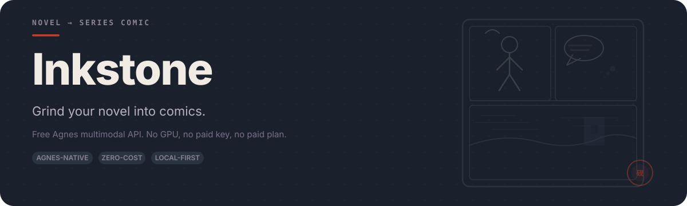
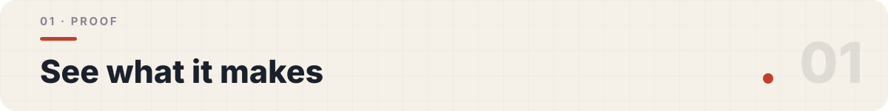
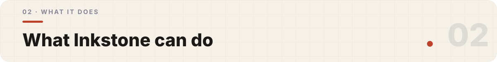
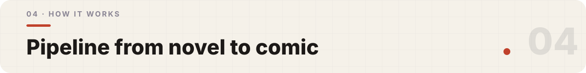
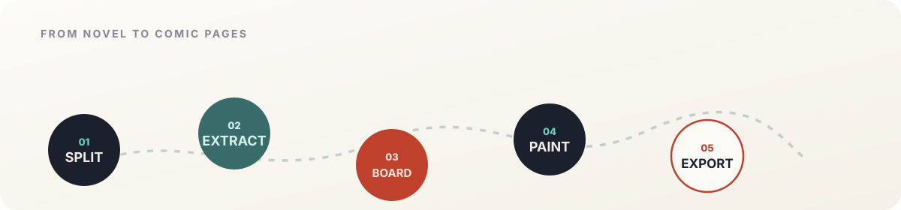

<p align="center">
  
</p>

<p align="center">
  <a href="https://github.com/phaethix/inkstone/releases"></a>
  <a href="./LICENSE"></a>
  <a href="https://github.com/phaethix/inkstone/actions/workflows/ci.yml"></a>
  
  
</p>

> *"Grind your novel into comics."*

**Inkstone** reads a local `txt` novel and, through the free **Agnes** multimodal API, produces comic pages with cross-panel character consistency — exported as **PDF / PNG**. No GPU, no paid plan: just one free API key.

---

<p align="center">
  
</p>

<p align="center">
  
  
  
</p>

These panels were generated from the bundled sample (`examples/scene1.txt`) with the default L1+L2 pipeline — no L3, straight from the model. Consistency here is "medium" by design: the honest ceiling of a free, no-GPU model. More samples, including the full webtoon strip, are at:

<p align="center">
  <b><a href="https://phaethix.github.io/inkstone/">phaethix.github.io/inkstone</a></b>
</p>

<p align="center">
  
</p>

- **Free & local-first** — one `AGNES_API_KEY`, no GPU, no paid plan.
- **Agnes-native multimodal** — `agnes-2.5-flash` for scripting, `agnes-image-2.1-flash` for t2i and i2i consistency.
- **Pluggable `ImageProvider`** — Agnes by default; `PROVIDER=openai_compat` for Agnes-protocol-compatible `/images/generations` gateways (i2i uses `extra_body.image`).
- **Character consistency engine** — L1 prompt hard-description + L2 reference img2img, the robust path under no-GPU. An optional L3 PIL/OpenCV face overlay is **off by default** (opt-in via `INKSTONE_L3=1`).
- **Reliability layer** — token-bucket rate limiting, exponential-backoff retries, and error collection against 429/503.
- **Resumable long-form runs** — chapter-split generation with a persisted `state.json` checkpoint.

<p align="center">
  
</p>

Every novel-to-comic tool we surveyed in 2026 runs on a **paid** model — Gemini, OpenAI, Doubao, Wenxin, or Claude. Inkstone is built differently: it is **Agnes-native and zero-cost**, the one combination no other open-source generator occupies.

| | Agnes-native | Zero-cost (no GPU / no paid key) |
|---|:---:|:---:|
| Other open-source comic generators | — | — (all paid APIs) |
| **Inkstone** | ✓ | ✓ |

Inkstone is an **independent implementation, not a fork** — inspired by [`lcy362/agnes-video-generator`](https://github.com/lcy362/agnes-video-generator) (MIT) but carrying none of its source tree. Attribution is recorded in [NOTICE](NOTICE).

> **An honest trade-off.** Free, cloud-only Agnes with no GPU caps how far character consistency can reach. The strongest approaches (IP-Adapter / InsightFace) need a local GPU running SDXL/Flux — incompatible with Inkstone's zero-cost premise. So Inkstone trades *perfect* consistency for *zero-cost + no-GPU + out-of-the-box*, using L1+L2+L3 as the best feasible strategy. Stated plainly, not hidden.

**Finished-page mode (default)** generates one designed comic page per image call (dynamic panels + in-image lettering). Free-tier models have ceilings on legible text and identity lock — Inkstone optimizes for page-shaped comics, not commercial print parity. If finished pages fail persistently, set `INKSTONE_RENDER_MODE=panel_compose` and re-run; the legacy panel + layout path reuses cached plans where possible.

<p align="center">
  
</p>

<p align="center">
  
</p>

A `txt` novel is split into segments → characters & scenes are extracted with `agnes-2.5-flash` → **finished-page mode (default)** plans one comic page per image call (dynamic panels + in-image lettering) → each page is painted directly → pages are bound to PDF or stacked into a webtoon PNG. For the legacy path, set `INKSTONE_RENDER_MODE=panel_compose`: storyboard prompts → per-panel generation → `LayoutEngine` grid layout → export.

The core challenge — **cross-panel character consistency without a GPU** — is handled by a layered strategy:

| Layer | Strategy | Default |
|-------|----------|:-------:|
| **L1** | Appearance-derived prompt hard-description | ✅ on |
| **L2** | Reference img2img from prior panels | ✅ on |
| **L3** | PIL/OpenCV face overlay | ❌ off (opt-in) |

Backed by a reliability layer (rate limiting, retries, and `state.json` resumption). Alias variants are flagged for **human merge/dismiss** (never silent); merges mark affected panels stale for selective redraw.

<p align="center">
  
</p>

> **Prerequisites:** Python 3.10+, [conda](https://docs.conda.io/projects/conda/en/latest/user-guide/install/index.html), and a free [Agnes](https://agnes-ai.com) API key (Free Access tier).

```bash
# 1. Create & activate the conda environment
conda create -n inkstone python=3.12 -y
conda activate inkstone
# Verify the env is active — `which python` must point inside the env
# (e.g. .../envs/inkstone/bin/python). If it still shows /opt/homebrew/... or
# /usr/bin, run `conda init zsh` and open a new terminal, then reactivate.

# 2. Install Inkstone (runtime + dev/test tooling)
python -m pip install -e ".[dev]"

# 3. Provide your API key
cp .env.example .env
#    then open .env and set AGNES_API_KEY=sk-xxx
```

Generate your first panel:

```console
$ python examples/first_panel.py   # run from the repo root
saved -> panel.png
```

Verify the install — the test suite runs fully offline:

```console
$ python -m pytest
# validates providers, schemas, layout/export, consistency, screenwriter,
# pipeline resume and content-safety behavior without real API calls
```

### One-click launch

```bash
./scripts/start.sh                                   # runs examples/scene1.txt -> comic_out (page PDF)
./scripts/start.sh examples/sample_novel.txt --format webtoon
```

On Windows use `.\scripts\start.ps1`. Sample inputs ship in `examples/` (`scene1.txt`, `sample_novel.txt`).

> **Status:** M1–M4 (provider foundation, comic pipeline, long-form hardening and open-source release) have shipped. See the [Roadmap](docs/ROADMAP.md) for released capability, local prototypes and the approved long-form plan.

## Web UI

A zero-dependency local UI (Tailwind SPA + a `http.server` backend — **no new pip package**) wraps the same pipeline:

```bash
AGNES_API_KEY=sk-xxx python web/server.py
# open http://127.0.0.1:8000
```

Paste a novel, optionally set a **project id** (resume the same `comic_out/<id>/`), pick webtoon/page, and hit Generate. The backend runs an **unattended supervisor** around `creative_comic`: timeouts and free-tier 503s are retried automatically with backoff until the comic finishes, or until the wall-clock deadline (`INKSTONE_RUN_DEADLINE_HOURS`, default **24h**) pauses the job with progress saved. Artifacts land under `comic_out/<project_id>/`. After generation, the UI surfaces **alias review** (merge / dismiss — never silent), **skipped** panels with retry, and **redraw affected** after a merge.

**The same `web/index.html` is also deployed to GitHub Pages.** The SPA auto-detects whether a backend is present: locally it generates your comic; on the static site it runs in *demo mode* with the identical interface. See `https://phaethix.github.io/inkstone/`.

## Configuration

Inkstone is configured through environment variables (copy `.env.example` → `.env`):

| Variable | Required | Default | Description |
|----------|:---:|---|---|
| `AGNES_API_KEY` | ✅ | — | Free Access tier key; the only thing ordinary users need. |
| `AGNES_CHAT_MODEL` | | `agnes-2.5-flash` | Text / tool-calling model ([docs](https://agnes-ai.cn/en/docs/agnes-25-flash)). |
| `AGNES_RATE_LIMIT` | | `20` | Free-tier text + image-1K RPM ceiling (× 0.8 safety factor). |
| `AGNES_IMAGE_2K_RPM` | | `10` | Free-tier image 2K RPM (max side ≤2048). |
| `AGNES_IMAGE_3K_RPM` | | `1` | Free-tier image 3K/4K RPM. |
| `AGNES_IMAGE_I2I_MODEL` | | `agnes-image-2.1-flash` | Model used for consistency img2img. |
| `AGNES_IMAGE_MAX_RETRIES` | | `5` | Image calls retry this many times. |
| `AGNES_IMAGE_RETRY_BASE_DELAY` | | `5.0` | Image retry backoff base in seconds. |
| `PROVIDER` | | `agnes` | `openai_compat` routes to configured OpenAI-style base URLs. |
| `OPENAI_COMPAT_*` | | — | Base URL / key / models when `PROVIDER=openai_compat`. |
| `INKSTONE_L3` | | `0` | Enable the experimental L3 PIL/OpenCV face overlay (`1` to turn on). |
| `INKSTONE_RENDER_MODE` | | `finished_page` | Default: one finished comic page per image call. Set `panel_compose` to use the legacy storyboard → panel → layout path (recovery when finished pages fail). |
| `INKSTONE_PAGE_SIZE` | | `1024x1536` | Finished-page image size. If the provider rejects the size, Inkstone retries once with `1024x1024`. |
| `INKSTONE_FONT_PATH` | | (auto) | TrueType/OpenType font for dialogue bubbles. |
| `INKSTONE_WEBTOON_MAX_PIXELS` | | `200000000` | Refuse single-strip webtoon compose above this pixel budget. `0` disables. |
| `INKSTONE_UI_HOST` / `INKSTONE_UI_PORT` | | `127.0.0.1` / `8000` | Web UI bind address. |

PDF export prefers the optional `manga2pdf` CLI for two-page / right-to-left manga layout (`pip install manga2pdf` to restore the gallery layout).

## Resources

- **Implementation status** — [docs/ROADMAP.md](docs/ROADMAP.md)
- **Colab CLI** — [docs/guides/colab-cli.md](docs/guides/colab-cli.md) + [`scripts/colab_run.sh`](scripts/colab_run.sh)
- **Historical plans / specs** — [docs/superpowers/](docs/superpowers/)
- **Contributing guide** — [CONTRIBUTING.md](CONTRIBUTING.md)
- **Issues & feedback** — [GitHub Issues](https://github.com/phaethix/inkstone/issues)

## Contributing

See [CONTRIBUTING.md](CONTRIBUTING.md). All code, docs, and commit messages are in English; commits follow [Conventional Commits](https://www.conventionalcommits.org/).

---

<p align="center">
  MIT License — <a href="./LICENSE">LICENSE</a>
</p>
